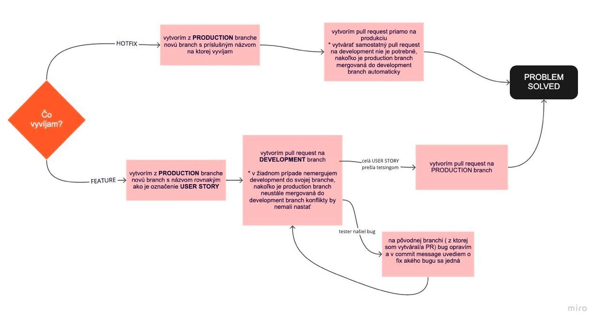

# notino_b2b_web

## Description

This is the frontend for Notino B2B web application.

## Installation

Before you start, please make sure you have installed:

- Node.js >= 16.13.0
- npm >= 8.0.0

To install the project, run:

```npm install --legacy-peer-deps```

## Usage
After installation, following environment variables must be set in the ```.env``` file to successfully start the application:

* **PROXY**: This variable specifies the proxy server that will be used for requests.
* **REACT_APP_GOOGLE_MAPS_API_KEY**: This variable contains the API key for the Google Maps API. It is used by your React application to display maps and location information.
* **FULLCALENDAR_LICENSE_KEY**: This variable contains the license key for the FullCalendar library. FullCalendar is a popular JavaScript library for creating interactive calendars and scheduling applications.
* **REACT_APP_SENTRY_ENV**: This variable sets the environment for Sentry, a popular error tracking service.
* **REACT_APP_SENTRY_DSN**: This variable contains the Data Source Name (DSN) for Sentry. The DSN is a unique identifier that allows Sentry to receive and track errors from your application.

To start the development server, run:

```npm start```

This will start the development server at http://localhost:3000/. You can view the app in the browser.

To build the project, run:

```npm run build```

To run tests, run:

```npm test```

## Technologies Used
* React
* TypeScript
* TailwindCSS
* Cypress
* FullCalendar
* Antd design
* React router v6
* Sass

## Scripts
* ```start```: starts the development server
* ```start-watch```: starts the development server with hot reloading enabled
* ```prebuild```: builds the application for production after running various build processes
* ```copy-modules```: copies modules to the build folder
* ```copy-build```: copies the contents of the build folder to an error page folder
* ```postbuild```: copies modules and builds the error page folder
* ```build```: builds the application for production
* ```build:coverage```: builds the application with coverage instrumentation
* ```lint```: lints the source code with eslint
* ```release```: builds the application for production and sends a release to Sentry
* ```sentry```: sends release data to Sentry
* ```test```: runs Cypress tests in an interactive mode
* ```test:CI```: runs Cypress tests in non-interactive mode for CI
* ```generate-coverage-summary```: generates a text summary of the coverage report
* ```eject```: ejects from react-scripts
* ```translate-scan```: scans source code for i18n keys
* ```translate-watch```: scans source code for i18n keys and watches for changes
* ```rebuild:sass```: rebuilds node-sass
* ```export-tailwind-config```: exports the tailwind config to a file
* ```build:tailwind```: builds the tailwind CSS file
* ```type-check```: type-checks the TypeScript source code
* ```normalize-apidoc```: normalizes the apidoc JSON file
* ```typegen```: generates TypeScript type definitions from the normalized apidoc JSON file
* ```download:apidoc```: downloads the apidoc JSON file
* ```generate-ts-api```: downloads and generates TypeScript type definitions from the apidoc JSON file
* ```translations-csv-to-json```: uses the "convert-csv-to-json" package to convert CSV files containing translations into JSON format. The package is pulled from the GoodRequest/i18nextJsonToCsv repository.
* ```translations-json-to-csv```: uses the "convert-json-to-csv" package to convert JSON files containing translations into CSV format. The package is pulled from the GoodRequest/i18nextJsonToCsv repository.
* ```wait-for-it```: bash shell script that waits for a specified service or port to become available before proceeding with a command. It is used to ensure that dependencies are available before running a script that relies on them.
* ```health-check-waiter```: bash shell script that waits for a health check endpoint to return a successful response before proceeding with a command. It is used to ensure that a service is healthy and ready to handle requests before running tests or deploying changes.
* ```generate-runtime-env```: uses the "cross-env" package to set environment variables for a Create React App (CRA) application. It uses the "env-cmd" package to load environment variables from a specified file (in this case, ".env.template"), and creates a runtime environment configuration file (runtime-env.js) based on the loaded environment variables.

### Repository workflow ###



